<picture><source media="(prefers-color-scheme: dark)" srcset="./banner-dark.svg"></picture>

<picture><source media="(prefers-color-scheme: dark)" srcset="./headline-dark.svg"></picture>

She holds a B.A. in Business Administration with a concentration in Supply Chain Management and minors in Accounting and Management Information Systems.

She is pursuing an M.S.B. with a dual concentration in Supply Chain Management and Business Intelligence, and is preparing for the [APICS CPIM®](https://www.ascm.org/learning-development/certifications-credentials/cpim/) and [CSCP®](https://www.ascm.org/learning-development/certifications-credentials/cscp/) and the [ISM CPSM®](https://www.ismworld.org/certification-and-training/certification/cpsm/) certifications.

Early in her career, she has earned SAP professional certificates in business analysis and technology consulting, and plans to pursue the [PMP®](https://www.pmi.org/certifications/project-management-pmp) as her work grows into project leadership.

For a fuller account of what she has done so far, her website opens two ways.

<picture><source media="(prefers-color-scheme: dark)" srcset="./label-dark.svg"></picture>

<a href="https://www.larawahab.com/candidate"><picture><source media="(prefers-color-scheme: dark)" srcset="./site-candidate-dark.svg"></picture></a>
<a href="https://www.larawahab.com/person"><picture><source media="(prefers-color-scheme: dark)" srcset="./site-person-dark.svg"></picture></a>

<code>README</code> — <em>Me, in an hour</em>

You chose the hour. Most people choose the minute, so thank you.

I am a New Yorker by birth and a newcomer by habit. I grew up across several countries in a family of Lebanese and Moroccan descent, and Casablanca is the one place I keep coming back to. School happened in English, on an American curriculum. Life happened in French, in whichever Francophone city we called home that year.

Moving that often makes you the new girl more times than you can count. You learn to read a room before you speak in it. You notice who holds the answers, how things really get done, and which rules are written down and which are simply understood. By the time the boxes are unpacked, you have usually worked out the whole system.

I suspect that is where the analyst in me began. I have always loved puzzles, the kind with a thousand pieces and no picture on the lid. I tip every piece onto the table, turn each one face up, sort the edges from the middle and the sky from the sea, and then I wait. There is always a moment when the scattered pieces stop being noise and start becoming a picture. I have been chasing that moment ever since.

I am also, by nature, someone who likes things in their place. My files are named, my notes are structured, and my desk is clear before I begin. Order is not tidiness for its own sake. It is how I think. Once everything is laid out and labeled, patterns appear that were invisible in the clutter.

A supply chain is that puzzle at scale. Thousands of pieces move at once, from stock and orders to lead times and forecasts, and somewhere in the data is the picture of what is really happening. My work is to find it, to ask why the numbers look the way they do, and to turn the answer into something a manager can act on.

Today that means inventory and demand, the dashboards that report on them, and the decisions in between. I am building my first analytics projects here, one question at a time. If you are working on something in that space, I would love to compare notes. For collaborations, projects or simply a good conversation, say [hi@larawahab.com](mailto:hi@larawahab.com).

As for where I have been, the route so far runs through eleven moves and eight countries, with Casablanca appearing more than once for good reason.

<picture><source media="(prefers-color-scheme: dark)" srcset="./route-dark.svg"></picture>

Next comes the East Coast of the United States. New York City would make it a homecoming, and Philadelphia would make it a new chapter. Either way, I will be the new girl again, and I already know how that story goes.

### Tools

<picture><source media="(prefers-color-scheme: dark)" srcset="./tool-microsoftexcel-dark.svg"></picture>
<picture><source media="(prefers-color-scheme: dark)" srcset="./tool-sql-dark.svg"></picture>
<picture><source media="(prefers-color-scheme: dark)" srcset="./tool-python-dark.svg"></picture>
<picture><source media="(prefers-color-scheme: dark)" srcset="./tool-jupyter-dark.svg"></picture>
<picture><source media="(prefers-color-scheme: dark)" srcset="./tool-powerbi-dark.svg"></picture>
<picture><source media="(prefers-color-scheme: dark)" srcset="./tool-tableau-dark.svg"></picture>
<picture><source media="(prefers-color-scheme: dark)" srcset="./tool-sap-dark.svg"></picture>
<picture><source media="(prefers-color-scheme: dark)" srcset="./tool-microsoftoffice-dark.svg"></picture>
<picture><source media="(prefers-color-scheme: dark)" srcset="./tool-notion-dark.svg"></picture>
<picture><source media="(prefers-color-scheme: dark)" srcset="./tool-salesforce-dark.svg"></picture>
<picture><source media="(prefers-color-scheme: dark)" srcset="./tool-asana-dark.svg"></picture>
<picture><source media="(prefers-color-scheme: dark)" srcset="./tool-obsidian-dark.svg"></picture>
<picture><source media="(prefers-color-scheme: dark)" srcset="./tool-github-dark.svg"></picture>

### Languages

<picture><source media="(prefers-color-scheme: dark)" srcset="./lang-english-dark.svg"></picture>
<picture><source media="(prefers-color-scheme: dark)" srcset="./lang-french-dark.svg"></picture>
<picture><source media="(prefers-color-scheme: dark)" srcset="./lang-arabic-dark.svg"></picture>
<picture><source media="(prefers-color-scheme: dark)" srcset="./lang-mandarin-dark.svg"></picture>

### Pronunciation

<a href="https://larawahab.github.io/LaraWahab/lara.mp3"><picture><source media="(prefers-color-scheme: dark)" srcset="./pronunciation-dark.svg"></picture></a>

### Quirks

<picture><source media="(prefers-color-scheme: dark)" srcset="./quirk-01-dark.svg"></picture>
<picture><source media="(prefers-color-scheme: dark)" srcset="./quirk-02-dark.svg"></picture>
<picture><source media="(prefers-color-scheme: dark)" srcset="./quirk-03-dark.svg"></picture>
<picture><source media="(prefers-color-scheme: dark)" srcset="./quirk-04-dark.svg"></picture>
<picture><source media="(prefers-color-scheme: dark)" srcset="./quirk-05-dark.svg"></picture>
<picture><source media="(prefers-color-scheme: dark)" srcset="./quirk-06-dark.svg"></picture>
<picture><source media="(prefers-color-scheme: dark)" srcset="./quirk-07-dark.svg"></picture>
<picture><source media="(prefers-color-scheme: dark)" srcset="./quirk-08-dark.svg"></picture>
<picture><source media="(prefers-color-scheme: dark)" srcset="./quirk-09-dark.svg"></picture>
<picture><source media="(prefers-color-scheme: dark)" srcset="./quirk-10-dark.svg"></picture>
<picture><source media="(prefers-color-scheme: dark)" srcset="./quirk-11-dark.svg"></picture>

### Interests

<picture><source media="(prefers-color-scheme: dark)" srcset="./interest-calligraphy-dark.svg"></picture>
<picture><source media="(prefers-color-scheme: dark)" srcset="./interest-reading-dark.svg"></picture>
<picture><source media="(prefers-color-scheme: dark)" srcset="./interest-photography-dark.svg"></picture>
<picture><source media="(prefers-color-scheme: dark)" srcset="./interest-dance-dark.svg"></picture>
<picture><source media="(prefers-color-scheme: dark)" srcset="./interest-pottery-dark.svg"></picture>

<a href="https://www.larawahab.com"><picture><source media="(prefers-color-scheme: dark)" srcset="./closing-dark.svg"></picture></a>

<a href="https://public.tableau.com/app/profile/lara.wahab"><picture><source media="(prefers-color-scheme: dark)" srcset="./link-tableau-dark.svg"></picture></a>
<a href="https://www.kaggle.com/larawahab"><picture><source media="(prefers-color-scheme: dark)" srcset="./link-kaggle-dark.svg"></picture></a>
<a href="UPWORK-PROFILE-URL"><picture><source media="(prefers-color-scheme: dark)" srcset="./link-upwork-dark.svg"></picture></a>
<a href="https://www.credly.com/users/larawahab"><picture><source media="(prefers-color-scheme: dark)" srcset="./link-credly-dark.svg"></picture></a>

<a href="https://www.larawahab.com"><picture><source media="(prefers-color-scheme: dark)" srcset="./footer-dark.svg"></picture></a>
